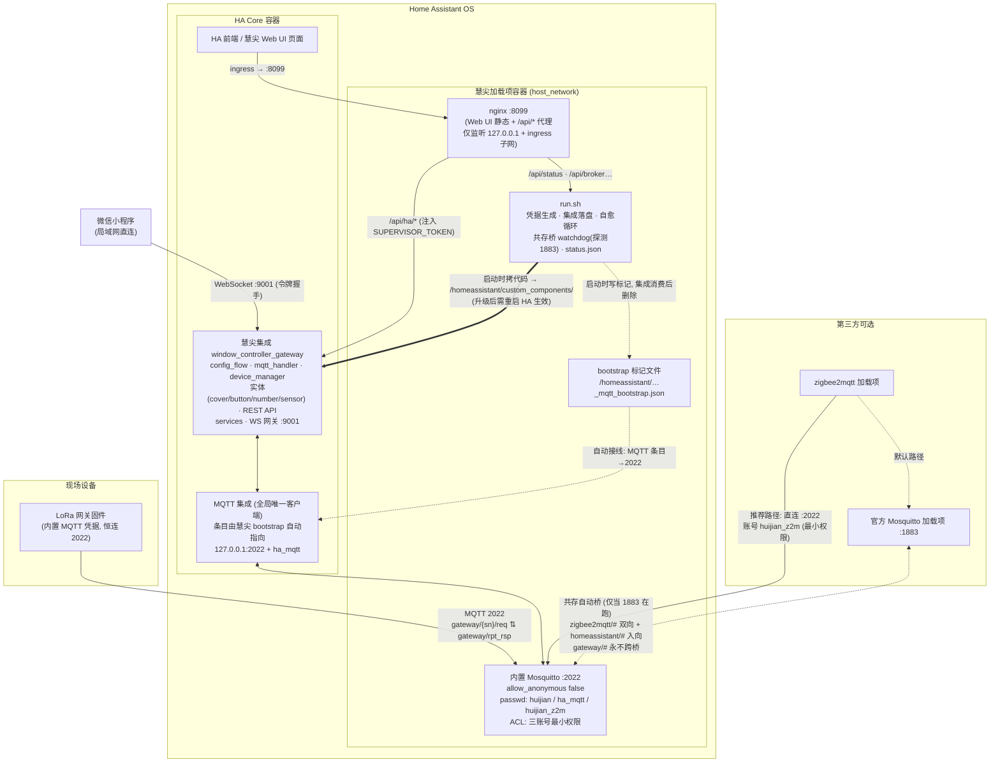

# 慧尖架构总览

一个交付物、三层结构：**加载项（壳）+ 集成（脑）+ 内置 broker（数据总线）**。

## 总体拓扑



纯文本简版（GitHub/Gitee 通用）：

```
LoRa固件 ══2022══▶ [内置Mosquitto] ◐HA MQTT集成(客户端)◎── [慧尖集成: 实体/API/WS]
   (共存桥,仅官方1883在跑时) ⇅          │                      ▲
z2m ──直连2022(huijian_z2m)────────────┘          Web UI ──nginx:8099──/api/ha/代理──┘
z2m ──或──官方Mosquitto:1883                        小程序 ──WS:9001(令牌)──┘
```

## 三条连接主线

| 主线 | 通道 | 说明 |
|---|---|---|
| **分发面** | 加载项 → HA 配置目录 | 集成代码内置在加载项镜像中（`/usr/share` → `/data` 回退链），run.sh 启动时按 manifest 版本比对并拷贝到 `/homeassistant/custom_components/`；HA 启动时加载 → **升级加载项后必须重启 HA** |
| **数据面** | MQTT :2022 | 固件 ⇅ 内置 broker ⇅ (HA MQTT 集成) ⇅ 慧尖集成。ack 方向契约：001/002/005 网关主动、HA 必须回 ack；003/004/006/007 HA 主动、不得回。控制/状态全走此线 |
| **接口面** | REST/WebSocket | Web UI 静态页与代理由加载项 nginx 出壳（`/api/ha/` 注入 token，密钥不进浏览器），业务逻辑在集成的 HTTP 视图；小程序走集成自带的 WS 网关 :9001（令牌握手，默认常听） |

## 版本耦合

`config.yaml`（加载项）· `www/version.json` · `www/index.html` CURRENT_VERSION ·
集成 `manifest.json` —— **四处版本号强制一致**（发版铁律，CI 校验）。

## 安全边界（v1.6.24 定案）

- 三账号最小权限互不越界：`huijian`（固件域）/ `ha_mqtt`（HA 消费白名单）/
  `huijian_z2m`（z2m 域）；MQTT 凭据由固件内置，用户不修改（产品设计）
- 共存桥只桥 z2m 生态主题；`gateway/#` 永不跨桥（匿名注入→物理开窗攻击链
  已真栈实锤封堵，负向 e2e 钉桩防复活）
- nginx :8099 拒绝一切非 127.0.0.1 / 172.30.32.x（ingress）来源
- 机制实证资产：`tests/e2e/bridge_coexist_e2e.sh`（桥全状态机+认证环境）、
  `tests/e2e/z2m_direct_e2e.sh`（生产认证形态 Z1-Z5 + 真 HA 消费）、
  `run_local.sh` + CI 硬门禁 E2E
